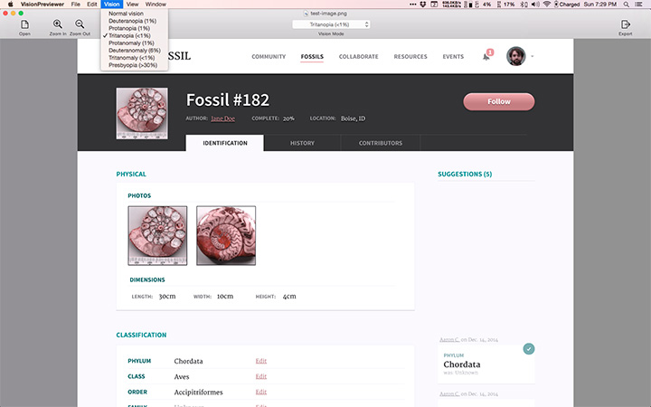

VisionPreviewer
===============

An OSX Preview-style image viewer that simulates various vision deficiencies associated with color blindness.

The primary use case of VisionPreviewer is to open an existing image file, preview how the image would look to person with a vision deficiency, and then export that preview as a new image.

## Acknowledgements

The `CIFilter`'s used to simulate vision deficiences come from Craig Hockenberry's [VisionDefectSimulation](https://github.com/chockenberry/VisionDefectSimulation) project.

The app uses an `IKImageView` to preview the image and, in order to provide zooming, uses Nicholas Riley's [ScrollViewWorkaround](http://stackoverflow.com/questions/2060614/ikimageview-and-scroll-bars).

## Other useful apps

* [Color Oracle](http://colororacle.org/)
* [Sim Daltonism](https://michelf.ca/projects/sim-daltonism/)
